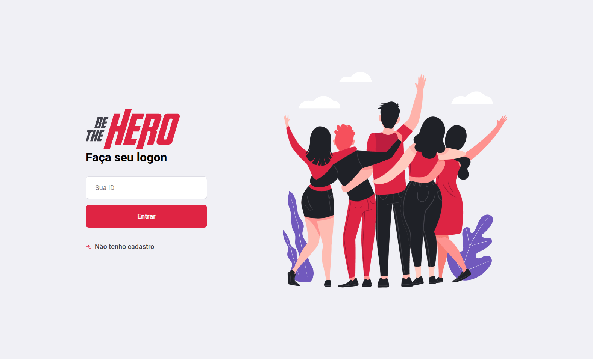
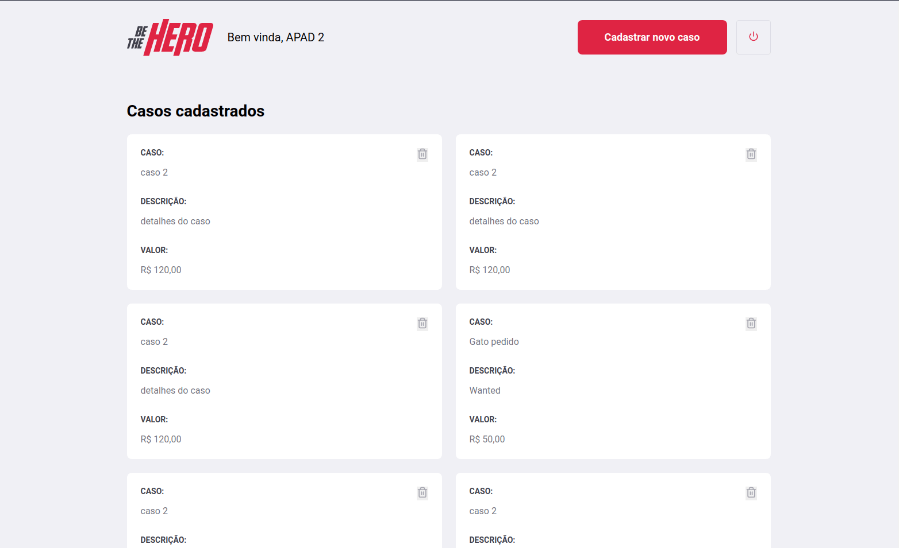
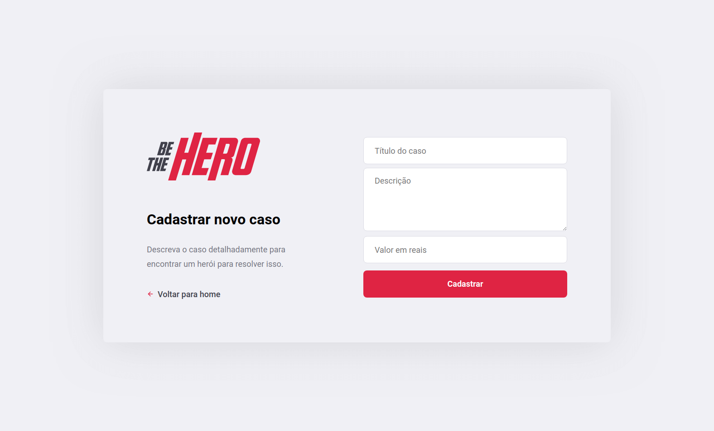
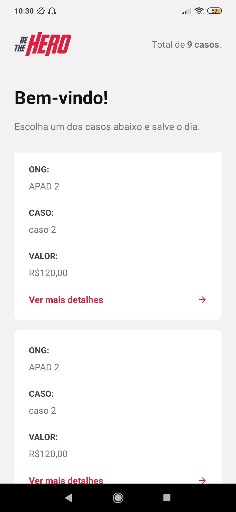

# Rocketseat Omnistack 11

<h1 align="center">
    
    
    
</h1>

<h1 align="center">
    
    
</h1>

## 💻 Projeto

Projeto desenvolvido no evento "Omnistack 11" da [Rocketseat](https://rocketseat.com.br/).

O BeTheHero é um projeto que visa conectar pessoas que desejam fazer contribuições monetárias a ONG's (Organizações não governamentais) que precisam de ajuda.

## :rocket: Tecnologias

Esse projeto foi desenvolvido com as seguintes tecnologias:

- [Node.js](https://nodejs.org/en/)
- [React](https://pt-br.reactjs.org/)
- [React Native](https://reactnative.dev/)
- [Expo](https://expo.io/)

## :information_source: Como usar

Para clonar essa aplicação, você vai precisar de [Git](https://git-scm.com/), Node.js v12 e [npm](https://www.npmjs.com/) instalado.

### Rodar API

```bash
# Diretório da API
cd backend

# Instalar dependências
npm install

# Rodar migração para criar um banco de dados SQLite em backend/src/database
npx knex migrate:latest

# Iniciar servidor rodando na porta 3333
npm start
```

### Rodar Frontend

```bash
# Diretório do frontend
cd frontend

# Instalar dependências
npm install

# Iniciar aplicação rodando na porta 3000
npm start
```

### Rodar Mobile

```bash
# Diretório do mobile
cd mobile

# Instalar dependências
npm install

# Iniciar aplicação no Expo
npm start
```

## :memo: Licença

Esse projeto está sob a licença MIT. Veja o arquivo [LICENSE](LICENSE.md) para mais detalhes.
